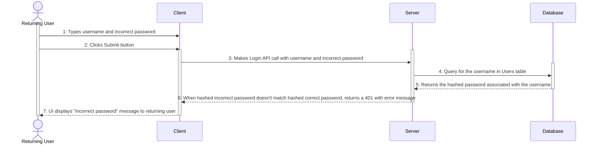
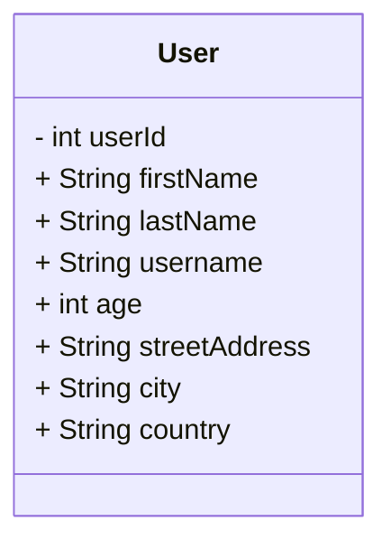

# Diagram-as-Code with Mermaid
This README tutorial will explain how to create sequence diagrams, class diagrams, and entity state diagrams using code. After reading the tutorial, check out the project files for examples of diagram-as-code in practice.

## Why Use Diagram-as-Code?
* It's faster. You type very little in exchange for a well-formatted diagram.
* No separate software; you can make your diagrams in your IDE.
* You can track changes to the diagrams using version control. 
* It's more reusable.

## Requirements 
* VS Code (tested on v1.85.2)
* Markdown Preview Mermaid Support (tested on v1.21.0)
* Mermaid Documentation: https://mermaid.js.org/intro/

## Installation
1. Download VS Code for your OS: https://code.visualstudio.com/download.
2. Follow the VS Code installation guide for your OS:<br>
  * Windows: https://code.visualstudio.com/docs/setup/windows
  * Mac: https://code.visualstudio.com/docs/setup/mac
  * Linux: https://code.visualstudio.com/docs/setup/linux
3. Install the extension Markdown Preview Mermaid Support to render previews of your diagrams: https://marketplace.visualstudio.com/items?itemName=bierner.markdown-mermaid

## Sequence Diagrams

<i>An example sequence diagram illustrating the order of operations for user login</i>
### What is a sequence diagram?
A sequence diagram shows you the flow of operations for a particular use case. They are technical diagrams typically referenced by other engineers/technical folks. More information on this type of UML diagram and its notation: https://www.geeksforgeeks.org/unified-modeling-language-uml-sequence-diagrams/ 
#### Developers
Let's pretend you developed the login feature for your company's app. In order to properly document and explain this feature to the rest of your development team, you might create a sequence diagram. The sequence diagram would illustrate, step-by-step, the communication between client, server, database, etc. 
#### Network Engineers 
While UML diagrams are typically used in software development, the concept of explaining order of operations to other engineers remains the same. You might use this diagram to explain interactions between network devices for educational purposes (i.e. DHCP Handshake), while troubleshooting with tech support, or for explaining network automation.
### Creating a sequence diagram with Mermaid
1. Create a .md file.
```
sequence_diagram.md
```
2. Indicate Mermaid syntax.
```
```mermaid
```
3. Declare the diagram type.
```
```mermaid
sequenceDiagram
```
4. Hit the Tab key, then list actors and participants. Actors produce stick figures, participants produce boxes. Use the keyword 'as' to create an alias.
```
actor User
participant Client
participant Server
participant Database
```
5. While still tabbed, use the keywords 'activate' and 'deactivate' to indicate when an actor or participant is active in the diagram.
```
activate Returning User
Returning User->>Client: 1: Types username and incorrect password
Returning User->>Client: 2: Clicks Submit button
activate Client
activate Server
Client->>Server: 3: Makes Login API call with username and incorrect password
activate Database
Server->>Database: 4: Query for the username in Users table
```
In the snippet above, we create a call with solid line with arrowhead using Participant/Actor1 ->> Participant/Actor2. To remove the arrowhead, simply use ->

6. There are multiple line types that can be used--see <a href=https://mermaid.js.org/intro/> Mermaid documentation.</a> In our sequence diagram photo above, we create the return calls (indicated by dashed lines with arrowheads) but using -->>. To remove the arrowhead, simply use -->
```
Database-->>Server: 5: Returns the hashed password associated with the username
```

7. Deactivate Participants/Actors as appropriate, if you haven't earlier in the diagram. Example below: 
```
deactivate Client
deactivate Returning User
```
8. Mark the end of your Mermaid file with ```
9. The final result of this example sequence diagram looks like this:
````

````

## Class Diagrams
### What is a class diagram?
A class diagram is an abbreviated visual of the contents of a given software class. For example, you might have a class called Door. The class diagram would list its properties (color = "brown", shape = "rectangle", height = 55) and its methods (for instance, OpenDoor(), ShutDoor(), SlamDoor()). 
### Creating a class diagram with Mermaid
1. Create a .md file.
```
sequence_diagram.md
```
2. Indicate Mermaid syntax.
```
```mermaid
```
3. Declare the diagram type.
```
```mermaid
classDiagram
```
4. Hit the Tab key, then name the class diagram using 'class<ClassName>'.
````
```mermaid
classDiagram
    classUser
```
````
4. While still tabbed, list the class properties using the syntax 'ClassName : +/-/#/~ type property'. ClassName will be the name of the class specified in the diagram. The +, -, #, ~ indicates whether the property is public, private, protected, or internal, respectively. Type will be the data type (i.e., int). Property is the property name.
````

````
5. 


