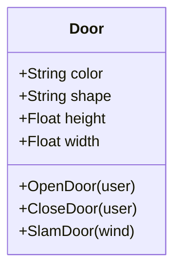

<!-- 
This class diagram using Mermaid has been created
for instructional purposes. 

Explanations can be found in the comments, denoted by %%.

We bookend this file, starting with ```mermaid and ending with ```
to signify that this file uses Mermaid.
-->

