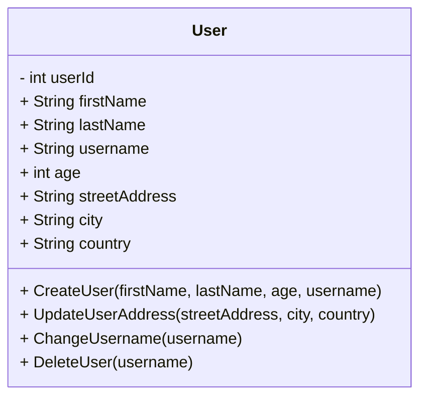

<!-- 
This is a sample class diagram of login functionality using diagram as code (Mermaid)
-->

```mermaid
classDiagram
    classUser
    User : - int userId
    User : + String firstName
    User : + String lastName
    User : + String username
    User : + int age
    User : + String streetAddress
    User : + String city
    User : + String country
    User : + CreateUser(firstName, lastName, age, username)
    User : + UpdateUserAddress(streetAddress, city, country)
    User : + ChangeUsername(username)
    User : + DeleteUser(username)
```