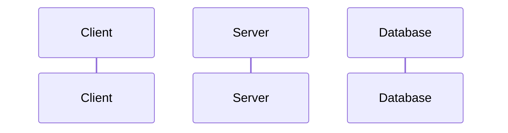

<!--
Client: Displays login page with fields for username and password
active Server
Client->>Server: When submit button clicked, sends login request with username and incorrect password
Server->>Database: Query for the username in Users table
Database->>Server: Returns the correct hashed password
Server: Hashes the provided password and compares it to the password in database
Server->>Client: Returns a 401 with error message
Client: UI displays error message "Incorrect password"
 -->
