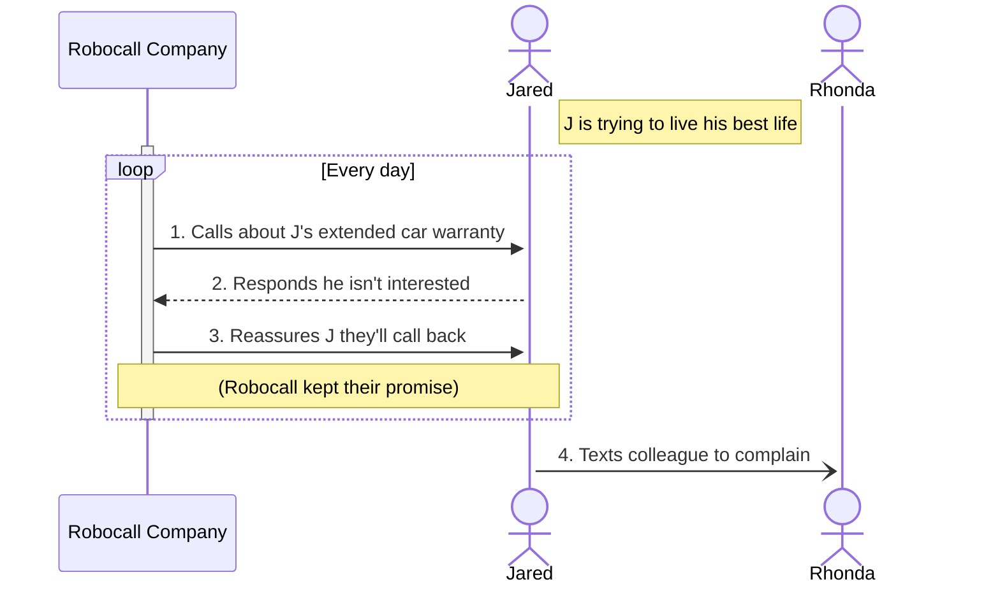

<!--
This sequence diagram using Mermaid has been created
for instructional purposes. In addition to explaining
basic sequence diagram syntax, it introduces:

* Notes
* Loops
* Async calls

Explanations can be found in the comments, denoted by %%.

We bookend this file, starting with ```mermaid and ending with ```
to signify that this file uses Mermaid.
-->

